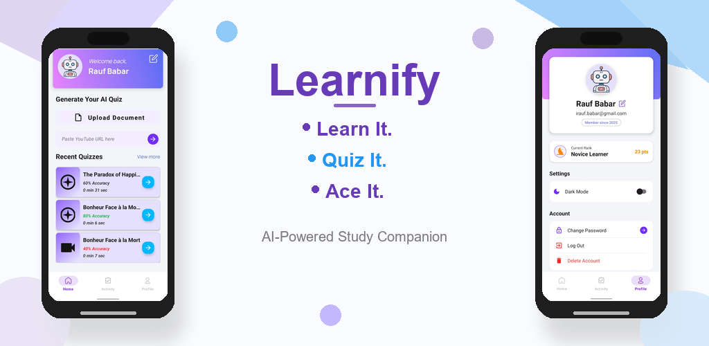

# Learnify: AI-Powered Study Companion

Learnify is a native Android application designed to transform how students interact with their study materials. By leveraging the power of Artificial Intelligence, Learnify automatically generates dynamic, comprehensive quizzes from a variety of sources including PDF documents, images (via Optical Character Recognition), and YouTube video transcripts.

Whether studying offline or syncing data to the cloud, Learnify provides a seamless, personalized learning experience, letting users Learn It, Quiz It, and Ace It.

## Feature Graphic

## Key Features
### Multi-Source Quiz Generation
- **YouTube Integration**: Fetches video transcripts via URL and converts them into structured quizzes.
- **Document Parsing**: Extracts and analyzes text directly from uploaded PDF files.
- **Image-to-Text (OCR)**: Uses on-device machine learning to read text from photos or gallery images.

### AI-Powered Engine
- Utilizes the Google Gemini API to process extracted content and intelligently generate relevant educational quizzes and feedback.

### Hybrid Storage System
- **Cloud Sync**: Stores user profiles and quiz history securely using Firebase Firestore.
- **Offline Mode**: Utilizes SQLite for local, on-device storage, ensuring study materials are available without an internet connection. Users have full control to clear local data at any time.

### Modern UI/UX
- Built with Material Design principles, featuring a clean dashboard, user rank tracking, and Dark Mode support.

## Tech Stack & Architecture

### Core Application
- Language: Java
- Framework: Android SDK
- Architecture: MVC / Native Android components

### AI & Machine Learning
- Google Gemini API (generativeai): Core LLM for processing context and generating quiz arrays
- Google ML Kit (play-services-mlkit-text-recognition): On-device OCR for image parsing

### Backend & Data Management
- Firebase: Authentication (Email/Password & Google Sign-In) and Firestore (Cloud database)
- SQLite: Local database for offline quiz retention
- Appwrite: Backend services for data handling and storage

### Networking & Parsing Utilities
- RapidAPI: Fetches YouTube video transcripts
- OkHttp3 & Jsoup: Network requests and HTML parsing
- PDFBox-Android: Text extraction from PDF documents
- Gson: JSON serialization/deserialization of AI responses

## Getting Started

### Prerequisites
- Android Studio (Latest Version)
- JDK 17+
- Google Cloud Console account (for Gemini API Key)
- Firebase Project configured for Android

### Installation
1. Clone the repository:
   ```bash
   git clone https://github.com/rauf-babar/Learnify_AI_Quiz_Generator.git


2. Open the project in Android Studio.

3. Configure API Keys:

   * Add your `google-services.json` file from Firebase into the `app/` directory.
   * Add your Gemini API Key and RapidAPI Key to your `local.properties` file:

     ```properties
     GEMINI_API_KEY=your_gemini_api_key_here
     RAPID_API_KEY=your_rapid_api_key_here
     ```

4. Sync Gradle and build the project.

5. Run the app on a physical device or an emulator.

## Privacy & Data Handling

Learnify respects user privacy. Quiz data generation happens via secure API calls, and OCR processing occurs entirely locally on your device to protect sensitive documents. Users retain full control to delete their accounts and all associated data, which permanently removes it from Firestore and Appwrite storage.

For full details, please review the Privacy Policy: [Privacy Policy](docs/privacy-policy.pdf)


